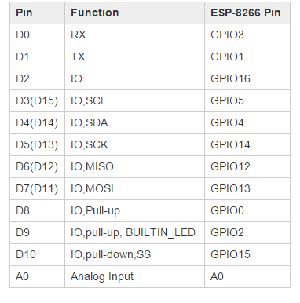
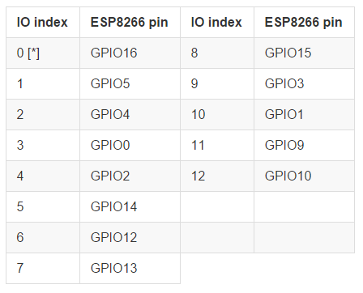

# ESP8266 nodeMCU LuaCode
This is my test code for nodeMCU-based ESP8266

Followings are my board and firmware settings.

## 1. Board: [WeMos D1](http://www.wemos.cc/wiki/doku.php?id=en:d1)

## 2. Pin Map
### WeMos D1 Board & ESP8266 Pin Map

### ESP8266 & NodeMCU(Lua) Pin Map

## 3. Firmware
### Download 1
- 'nodemcu\_float\_0.9.6-dev\_20150704.bin' in
[NodeMCU Firwware](https://github.com/nodemcu/nodemcu-firmware/releases)
- Baudrate: 9600bps

### Download 2
- Online build in [http://nodemcu-build.com/](http://nodemcu-build.com)
- You can select modules and receive it from e-mail.

## 4. NodeMCU Flasher (Firmware Downloader)
- Download and install NodeMCU Flasher for Windows in [http://www.14core.com/downloads-2/](http://www.14core.com/downloads-2/)

## 5.ESPlorer (NodeMCU IDE)
- Download and install ESPlorer in [http://www.14core.com/downloads-2/](http://www.14core.com/downloads-2/)

